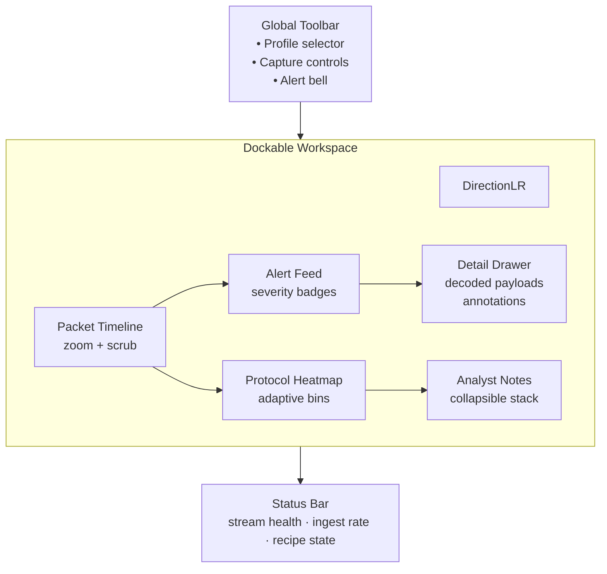
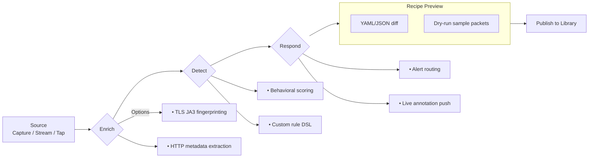

# SpectraTrace UI Mock-ups

## Dockable Telemetry Workspace

## Adaptive Recipe Builder

These wireframes guide the new dockable layout and recipe authoring experience planned for the SpectraTrace refresh.
